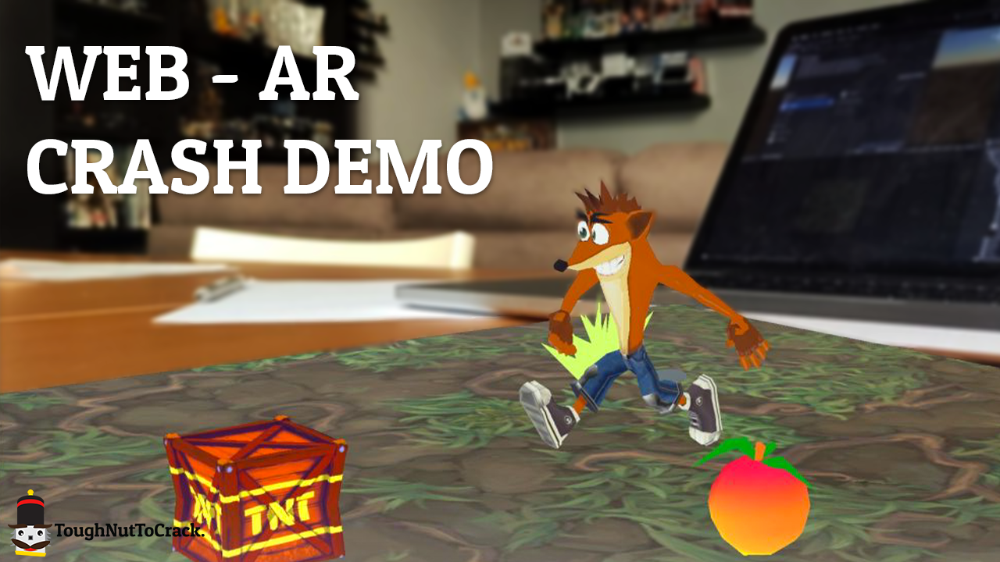

<h3 align="center">Crash Bandicoot 4 tribute in ARWT - Web AR with Unity</h3>

<a href="https://youtu.be/bcw7mwjXgpE" target="_blank">Check the full video on YouTube</a>

<a href="https://toughnuttocrack.it/arwtdemo" target="_blank">Live test the project by opening this link and framing the marker below.</a>

!! Tracking the marker directly from the monitor could create instability issues, print it to play the game horizontally !!

